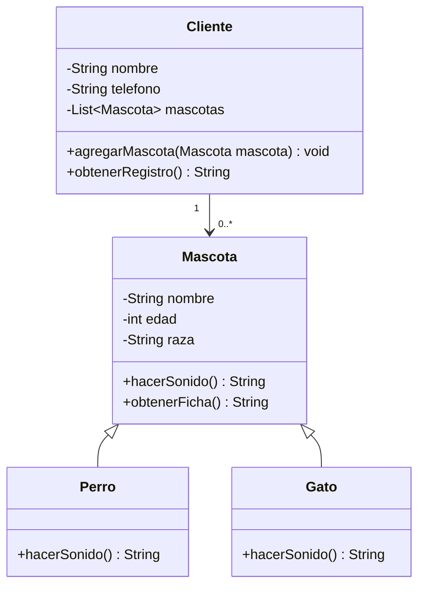

# Diagrama de Clases UML - Tienda de Mascotas

```mermaid
classDiagram
    class Mascota {
        -String nombre
        -int edad
        -String raza
        +hacerSonido() String
        +obtenerFicha() String
    }

    class Perro {
        +hacerSonido() String
    }

    class Gato {
        +hacerSonido() String
    }

    class Cliente {
        -String nombre
        -String telefono
        -List~Mascota~ mascotas
        +agregarMascota(Mascota mascota) void
        +obtenerRegistro() String
    }

    Mascota <|-- Perro
    Mascota <|-- Gato
    Cliente "1" --> "0..*" Mascota
```
